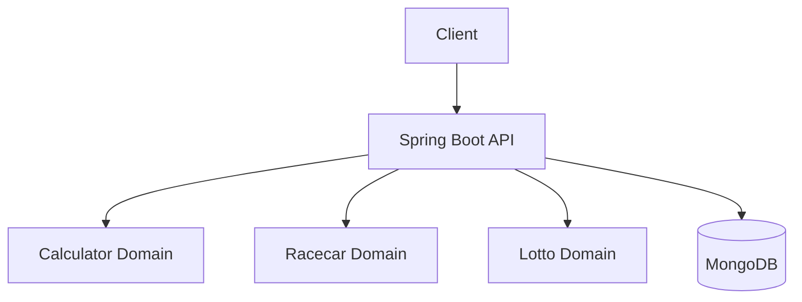

# 우아한테크코스 오픈 미션 API 서버
> **한 줄 소개**: 프리코스 1~3주차 과제를 Java/Spring API로 재설계하고 웹 서비스 흐름으로 확장한 프로젝트

## 1. 프로젝트 개요 (Overview)
- **개발 기간**: 2025년 오픈 미션 기간
- **개발 인원**: 개인 프로젝트
- **프로젝트 목적**: 콘솔 기반 문제를 API 서버로 전환하고 예외 처리/도메인 구조/협업 문서화를 강화
- **Repository**: /Users/dh/Desktop/Code/Project/woowatect-pre-course/java-open-mission-8

## 2. 사용 기술 및 선정 이유 (Tech Stack & Decision)

| Category | Tech Stack | Version | Decision Reason (Why?) |
| --- | --- | --- | --- |
| **Language** | Java | 21 | 도메인 모델과 객체지향 설계를 명확히 표현하기 위함 |
| **Framework** | Spring Boot + WebFlux + Validation | 3.3.5 | API 중심 서비스와 입력 검증/응답 표준화를 빠르게 구현 |
| **Database** | MongoDB | - | 미션 결과/상태 데이터 저장을 유연하게 처리하기 위함 |
| **Docs** | SpringDoc OpenAPI | 2.3.0 | 프론트와 API 계약을 명세 기반으로 맞추기 위함 |
| **Test** | JUnit, Reactor Test, Embedded Mongo | - | API/도메인 로직 검증과 테스트 독립성 확보 |

## 3. 시스템 아키텍처 (System Architecture)

- **설계 특징**:
- 미션별(`calculator`, `racingcar`, `lotto`) 도메인/서비스/컨트롤러 분리
- 전역 예외 처리(`GlobalExceptionHandler`)와 공통 에러 포맷 통일
- Swagger 명세와 시퀀스 다이어그램 기반 문서화

## 4. 핵심 기능 (Key Features)
- **문자열 계산기 API**: 커스텀 구분자 파싱, 유효성 검증, 합계 계산
- **자동차 경주 API**: 라운드별 진행 결과와 우승자 계산
- **로또 API**: 구매/당첨번호 입력/수익률 통계 계산
- **공통 에러 응답**: 상태코드/에러코드/메시지 표준화

## 5. 트러블 슈팅 및 성능 개선 (Troubleshooting & Refactoring)
### 5-1. 미션 확장 시 복잡도 증가 대응
- **문제(Problem)**: 기능이 늘어날수록 컨트롤러 중심 코드가 비대화될 위험
- **원인(Cause)**: 입력 검증/도메인 규칙/응답 조합을 컨트롤러에 직접 작성하면 재사용성 저하
- **해결(Solution)**:
  1. 미션 단위 패키징으로 관심사 분리
  2. 도메인 객체(`Name`, `TryCount`, `LottoNumber` 등)에 검증 책임 위임
- **검증(Verification)**: 신규 규칙 추가 시 해당 도메인/서비스 테스트만 수정되는지 점검
- **결과(Result)**: 기능 추가 시 변경 범위가 도메인별로 제한되어 유지보수성 향상

### 5-2. 에러 처리 일관성 개선
- **문제(Problem)**: API별 예외 응답 형식이 다르면 프론트 에러 처리 분기 증가
- **원인(Cause)**: 기능별 예외가 흩어져 있을 때 상태코드/메시지 형식 편차 발생
- **해결(Solution)**:
  1. 전역 예외 핸들러 도입
  2. 공통 에러 코드/응답 DTO 구조 통일
- **검증(Verification)**: 계산기/경주/로또 실패 요청에 동일한 에러 스키마 반환 확인
- **결과(Result)**: 클라이언트 에러 처리 로직 단순화, 디버깅 효율 향상

## 6. 프로젝트 회고 (Retrospective)
- **배운 점**: 단순 문제 풀이도 API/문서/예외 정책을 붙이면 실제 서비스 설계 훈련이 됨
- **아쉬운 점 & 향후 계획**: 부하 테스트 및 메트릭 수집을 추가해 정량 성능 지표까지 확보할 계획

## 7. API 명세
- API 요약 문서: `/Users/dh/Desktop/Code/Project/woowatect-pre-course/java-open-mission-8/docs/API_SPEC.md`
