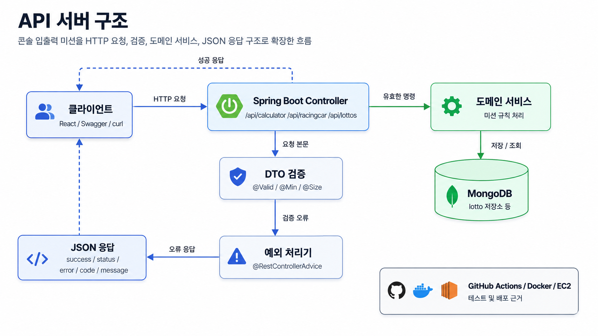
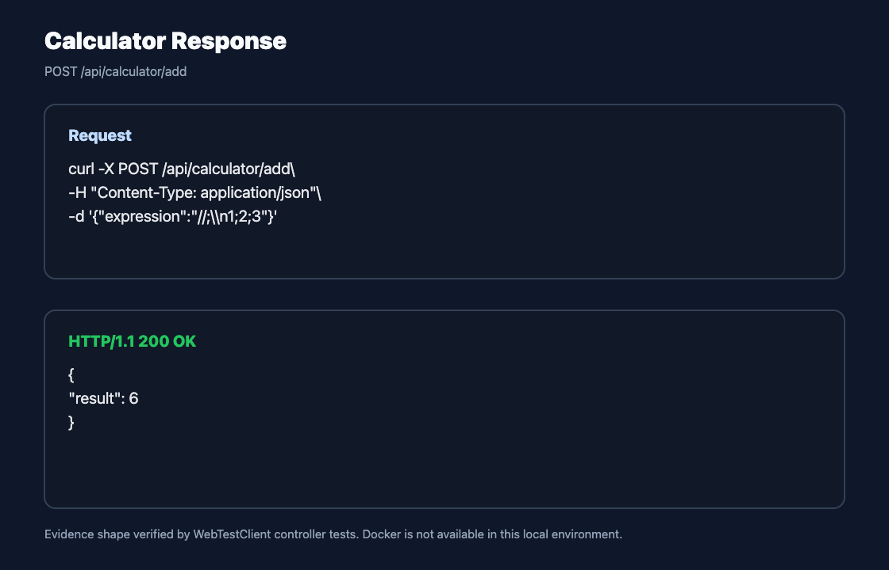
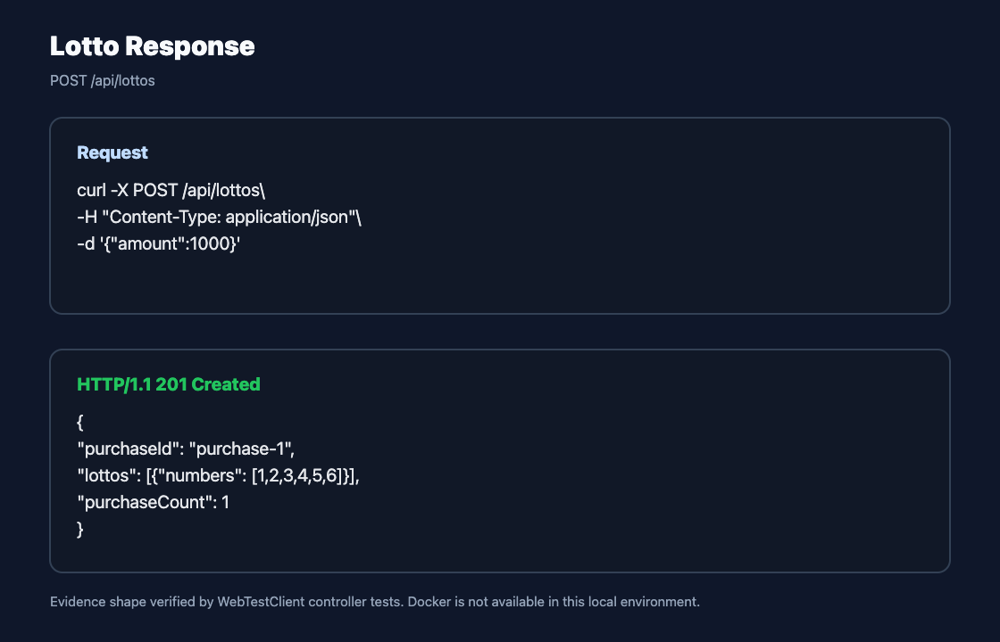
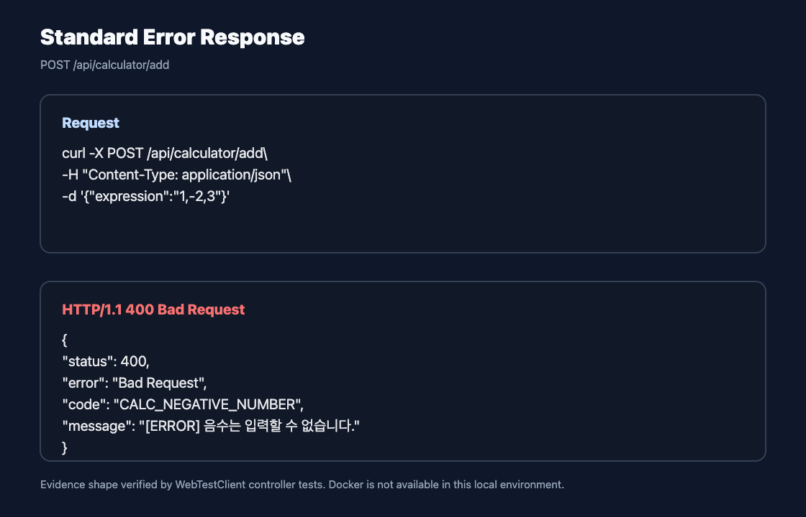
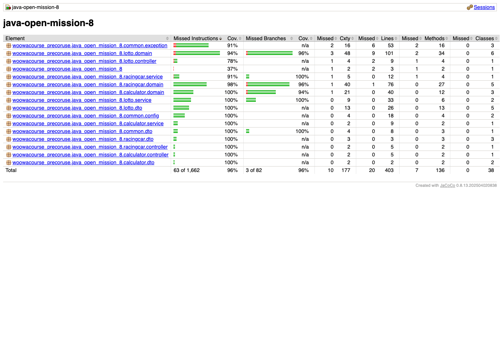

# Woowa Course Mission API Server

> 본 프로젝트는 우아한테크코스 8기 프리코스 1~3주차 콘솔 미션을 Java/Spring Boot 기반 REST API 서버로 확장한 프로젝트입니다.

## 1. 왜 API 서버로 확장했나

콘솔 미션은 한 번의 입력과 출력으로 끝나기 때문에 프론트엔드가 호출할 수 있는 요청/응답 구조, 표준 오류 응답, 상태 저장, 배포 흐름을 보여주기 어렵습니다. 이 프로젝트는 문자열 덧셈 계산기, 자동차 경주, 로또의 도메인 규칙을 유지하면서 HTTP request, DTO validation, domain service, JSON response 구조로 재구성했습니다.

## 2. 한눈에 보는 API 구조



| 계층 | 역할 |
| :--- | :--- |
| Client | React, Swagger, curl에서 JSON 요청 전송 |
| Controller | `/api/calculator`, `/api/racingcar`, `/api/lottos` 진입점 |
| DTO Validation | `@Valid`, `@Min`, `@Size`로 요청 형식 검증 |
| Domain Service | 콘솔 미션의 계산, 경주, 로또 규칙 실행 |
| Exception Handler | `@RestControllerAdvice`로 표준 오류 JSON 반환 |
| MongoDB | 로또 구매 내역을 `purchaseId` 기준으로 저장/조회 |

## 3. 핵심 API 응답 증거

Docker가 로컬 환경에 없어 실제 서버와 MongoDB를 띄운 curl 캡처는 만들지 못했습니다. 아래 이미지는 controller 테스트에서 WebTestClient로 검증한 요청/응답 계약을 curl 형태로 재구성한 증거입니다.
프론트엔드 화면이 없는 백엔드 API 레포이므로 GIF 대신 API 응답 이미지를 사용했습니다.





## 4. 예외 응답 표준화

도메인 예외와 DTO validation 실패는 프론트엔드가 같은 방식으로 처리할 수 있도록 `status`, `error`, `code`, `message` 구조로 응답합니다.



## 5. 테스트와 커버리지

`2026-06-04` 로컬에서 Gradle 명령을 다시 실행해 테스트 수와 coverage 수치를 확인했습니다.

```bash
./gradlew clean test
./gradlew jacocoTestReport
```

| 항목 | 결과 |
| :--- | :--- |
| 테스트 | 102개 통과, 실패 0, errors 0, skipped 0 |
| Gradle test | `BUILD SUCCESSFUL in 5s` |
| Line coverage | 95.04% |
| Branch coverage | 96.34% |
| Coverage gate | threshold rule 없음 |



API latency, throughput, p95는 측정하지 않았으므로 이력서에 성능 개선 수치로 쓰지 않습니다.

## 6. 이력서에 연결할 문장

- 콘솔 기반 프리코스 미션을 REST API 요청/응답 구조로 확장했습니다.
- DTO validation, custom exception, `@RestControllerAdvice`를 사용해 API 오류 응답을 표준화했습니다.
- 테스트와 커버리지 리포트를 생성해 API 서버의 검증 결과를 문서화했습니다.

## 7. README에 붙일 링크

루트 `README.md`는 수정하지 않았습니다. 나중에 README에 연결할 링크 문구는 [README_LINK_SNIPPET.md](./README_LINK_SNIPPET.md)에만 작성했습니다.
