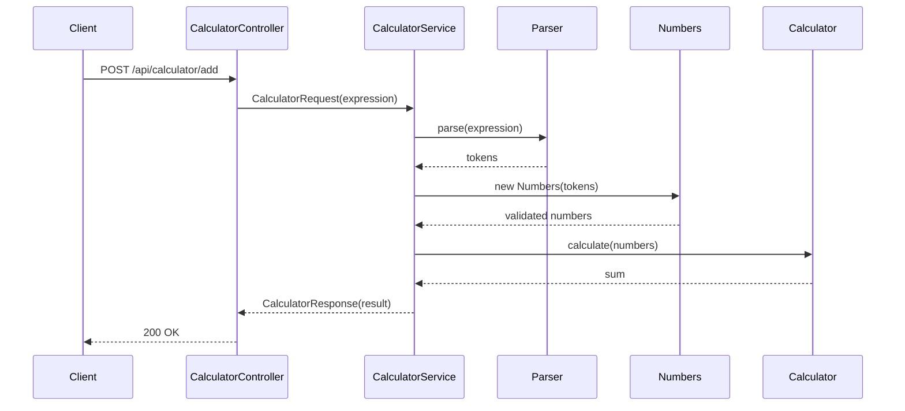
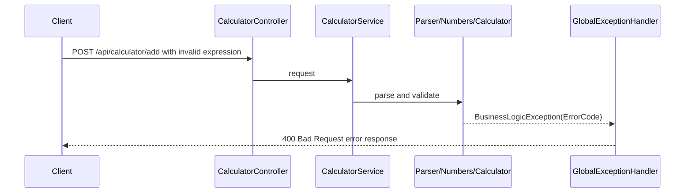

# Calculator Add API Flow

본 프로젝트의 문자열 덧셈 계산기 API는 콘솔에서 입력받던 숫자 문자열을 JSON 요청으로 받고, 분리된 숫자의 합계를 JSON으로 반환합니다.

## 목적

- 기본 구분자 `,`, `:` 또는 커스텀 구분자 `//구분자\n` 형식으로 숫자 문자열을 분리합니다.
- 숫자가 아닌 토큰과 음수를 domain 단계에서 검증합니다.
- 프론트엔드가 계산 결과와 오류를 HTTP 응답으로 처리할 수 있게 합니다.

## Endpoint

| Method | Path | Request DTO | Response DTO | Status |
| :--- | :--- | :--- | :--- | :--- |
| `POST` | `/api/calculator/add` | `CalculatorRequest` | `CalculatorResponse` | `200 OK` |

## Request

```json
{
  "expression": "//;\\n1;2;3"
}
```

| 필드 | 타입 | 설명 |
| :--- | :--- | :--- |
| `expression` | string | 계산할 문자열입니다. 빈 문자열 또는 `null`은 현재 구현에서 합계 `0`으로 처리됩니다. |

## Response

```json
{
  "result": 6
}
```

## 성공 흐름



## 실패 흐름



## 예외 응답 예시

음수를 포함한 요청입니다.

```json
{
  "expression": "1,-2,3"
}
```

응답 예시입니다.

```json
{
  "status": 400,
  "error": "Bad Request",
  "code": "CALC_NEGATIVE_NUMBER",
  "message": "[ERROR] 음수는 입력할 수 없습니다."
}
```

숫자가 아닌 토큰은 `CALC_INVALID_FORMAT`, 빈 커스텀 구분자는 `CALC_INVALID_CUSTOM_DELIMITER`로 처리됩니다.

## 설계 판단

- 문자열 분리 책임은 `Parser`, 숫자 변환과 음수 검증은 `Numbers`, 합산은 `Calculator`로 분리했습니다.
- DTO에는 현재 validation annotation이 없으므로 API 입력 검증의 대부분은 domain 객체 생성 중 수행됩니다.
- 빈 입력은 `Parser.parse()`가 빈 리스트를 반환하고, 합계가 `0`이 되는 현재 구현을 따릅니다.
