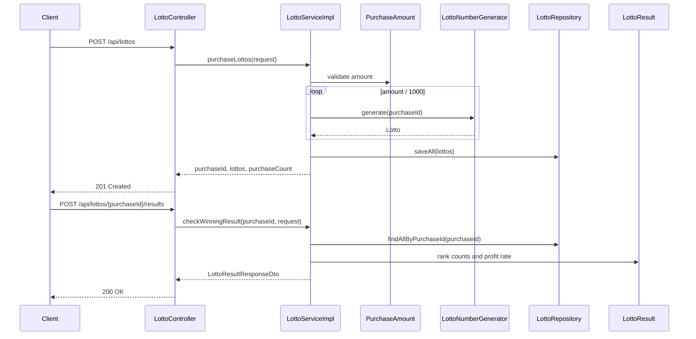
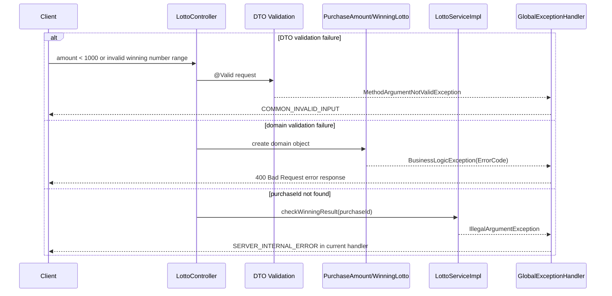

# Lotto Purchase And Result API Flow

본 프로젝트의 로또 API는 콘솔에서 구입 금액과 당첨 번호를 순서대로 입력하던 흐름을 구매 API와 결과 확인 API로 분리합니다.

## 목적

- 구입 금액을 받아 1,000원 단위로 로또를 발행합니다.
- 발행된 로또를 MongoDB에 저장하고 `purchaseId`를 반환합니다.
- `purchaseId`와 당첨 번호를 받아 당첨 등수별 개수와 수익률 비율을 계산합니다.

## Endpoint

| Method | Path | Request DTO | Response DTO | Status |
| :--- | :--- | :--- | :--- | :--- |
| `POST` | `/api/lottos` | `LottoPurchaseRequestDto` | `LottosPurchaseResponseDto` | `201 Created` |
| `POST` | `/api/lottos/{purchaseId}/results` | `WinningLottoRequestDto` | `LottoResultResponseDto` | `200 OK` |
| `DELETE` | `/api/lottos/reset` | 없음 | 없음 | `204 No Content` |

`DELETE /api/lottos/reset`은 controller 설명 기준 테스트용 데이터 삭제 API입니다.

## 구매 Request

```json
{
  "amount": 14000
}
```

| 필드 | 타입 | 검증 |
| :--- | :--- | :--- |
| `amount` | number | DTO에서 1,000원 이상, domain에서 1,000원 단위와 100,000원 이하를 검증합니다. |

## 구매 Response

```json
{
  "purchaseId": "generated-uuid",
  "lottos": [
    { "numbers": [8, 21, 23, 41, 42, 43] },
    { "numbers": [3, 5, 11, 16, 32, 38] }
  ],
  "purchaseCount": 14
}
```

## 결과 Request

```json
{
  "winningNumbers": [1, 2, 3, 4, 5, 6],
  "bonusNumber": 7
}
```

| 필드 | 타입 | 검증 |
| :--- | :--- | :--- |
| `winningNumbers` | number array | `null` 금지, 정확히 6개, 각 값 1 이상 45 이하, domain에서 중복 금지 |
| `bonusNumber` | number | 1 이상 45 이하, domain에서 당첨 번호와 중복 금지 |

## 결과 Response

```json
{
  "resultCounts": {
    "FIFTH": 1,
    "NOTHING": 13
  },
  "profitRate": 0.35714285714285715
}
```

`profitRate`는 현재 코드 기준 `totalPrize / purchaseAmount` 비율입니다. 퍼센트 값으로 100을 곱하지 않습니다.

## 성공 흐름



## 실패 흐름



## 수익률 계산 흐름

1. `WinningLotto.match()`가 사용자 로또의 당첨 번호 일치 개수와 보너스 일치 여부로 `Rank`를 결정합니다.
2. `LottoServiceImpl`이 `Rank`별 개수를 `EnumMap`에 누적합니다.
3. `LottoResult.getTotalPrize()`가 등수별 당첨 금액과 개수를 곱해 총 당첨 금액을 계산합니다.
4. `PurchaseAmount.calculateProfitRate(totalPrize)`가 `totalPrize / amount`를 반환합니다.

## 설계 판단

- 구매 API와 결과 API를 분리해, 프론트엔드가 구매 후 받은 `purchaseId`를 다음 단계의 상태 키로 사용할 수 있게 했습니다.
- 로또 번호는 `LottoNumber`에서 1부터 45까지 범위를 검증하고, `Lotto`에서 6개 수량과 중복을 검증합니다.
- 구매 ID 미존재 응답은 현재 Swagger 설명과 실제 handler 동작이 다를 수 있어 개선 후보로 남깁니다.
