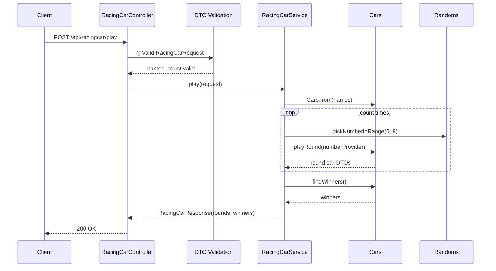
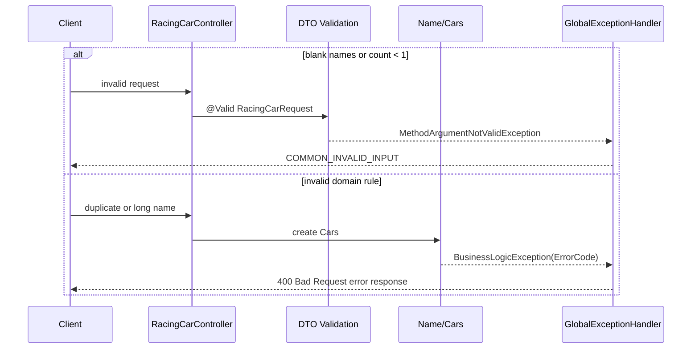

# Racing Car Play API Flow

본 프로젝트의 자동차 경주 API는 콘솔에서 자동차 이름과 시도 횟수를 입력받던 흐름을 JSON 요청과 라운드별 JSON 응답으로 확장합니다.

## 목적

- 쉼표로 구분한 자동차 이름과 시도 횟수를 받아 경주를 실행합니다.
- 각 라운드 종료 시점의 자동차 위치를 응답에 포함합니다.
- 최종 위치가 가장 높은 자동차 이름을 우승자로 반환합니다.

## Endpoint

| Method | Path | Request DTO | Response DTO | Status |
| :--- | :--- | :--- | :--- | :--- |
| `POST` | `/api/racingcar/play` | `RacingCarRequest` | `RacingCarResponse` | `200 OK` |

## Request

```json
{
  "names": "pobi,woni,jun",
  "count": 3
}
```

| 필드 | 타입 | 검증 |
| :--- | :--- | :--- |
| `names` | string | DTO에서 blank를 금지합니다. domain에서 쉼표 분리, trim, 이름 5자 이하, 공백 금지, 중복 금지, 최소 2대 조건을 검사합니다. |
| `count` | number | DTO에서 `1` 이상을 요구합니다. |

## Response

자동차 이동은 `Randoms.pickNumberInRange(0, 9)` 결과가 `4` 이상일 때 한 칸 전진하므로 예시 위치는 실행마다 달라질 수 있습니다.

```json
{
  "rounds": [
    [
      { "name": "pobi", "position": 1 },
      { "name": "woni", "position": 0 },
      { "name": "jun", "position": 1 }
    ],
    [
      { "name": "pobi", "position": 1 },
      { "name": "woni", "position": 1 },
      { "name": "jun", "position": 2 }
    ],
    [
      { "name": "pobi", "position": 2 },
      { "name": "woni", "position": 1 },
      { "name": "jun", "position": 2 }
    ]
  ],
  "winners": ["pobi", "jun"]
}
```

## 성공 흐름



## 실패 흐름



## 검증 기준

| 기준 | 처리 위치 | ErrorCode |
| :--- | :--- | :--- |
| 자동차 이름 필수 | DTO validation | `COMMON_INVALID_INPUT` |
| 시도 횟수 1 이상 | DTO validation | `COMMON_INVALID_INPUT` |
| 이름 blank | `Name` | `RACE_NAME_BLANK` |
| 이름 5자 초과 | `Name` | `RACE_NAME_TOO_LONG` |
| 이름 중복 | `Cars` | `RACE_NAME_DUPLICATED` |
| 자동차 2대 미만 | `Cars` | `RACE_CAR_COUNT_INSUFFICIENT` |

## 우승자 계산 흐름

1. `RacingCarService`가 `count`만큼 라운드를 반복합니다.
2. 각 라운드에서 자동차별 랜덤 숫자가 `4` 이상이면 `Position`을 1 증가시킵니다.
3. 모든 라운드가 끝나면 `Cars.findWinners()`가 최대 `Position`을 찾습니다.
4. 최대 위치와 같은 자동차 이름을 모두 `winners`로 반환합니다.

## 설계 판단

- 응답에 모든 라운드 상태를 포함해 프론트엔드가 경주 진행 과정을 렌더링할 수 있게 했습니다.
- 이름 생성과 컬렉션 검증을 domain에 두어 API 외부에서도 같은 규칙을 재사용할 수 있게 했습니다.
- 공동 우승 가능성을 고려해 `winners`를 문자열 리스트로 반환합니다.
