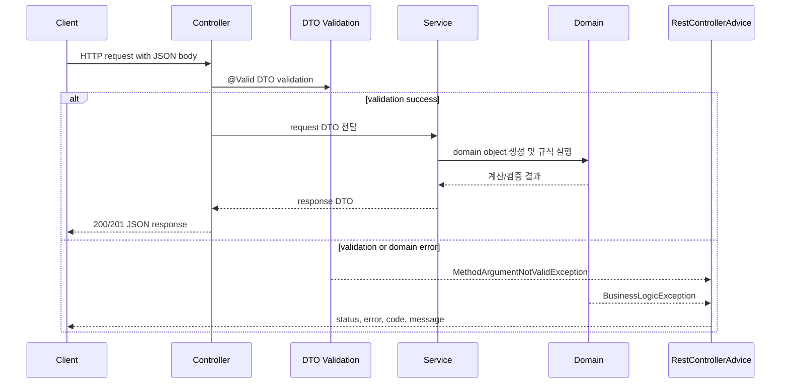

# Architecture

본 프로젝트는 콘솔에서 입력을 받고 결과를 출력하던 프리코스 미션을 HTTP 요청과 JSON 응답을 주고받는 Spring Boot API 서버로 확장합니다. 핵심 도메인 규칙은 `domain` 패키지에 유지하고, 외부 입출력은 `controller`, `dto`, `service` 계층으로 분리했습니다.

## Console Mission -> Spring Boot API Server

| 콘솔 미션 요소 | API 서버 확장 |
| :--- | :--- |
| 콘솔 입력 | JSON request body |
| 콘솔 출력 | JSON response body |
| 입력 검증 실패 | HTTP status + error code + message |
| 미션별 실행 함수 | REST endpoint |
| 사용자 흐름 | 프론트엔드가 호출 가능한 API 흐름 |

## 패키지 구조

| 영역 | 위치 | 역할 |
| :--- | :--- | :--- |
| 문자열 덧셈 계산기 | `src/main/java/.../calculator` | 문자열 파싱, 숫자 검증, 합산 API |
| 자동차 경주 | `src/main/java/.../racingcar` | 자동차 이름/횟수 검증, 라운드 진행, 우승자 계산 API |
| 로또 | `src/main/java/.../lotto` | 로또 구매, MongoDB 저장, 당첨 결과 계산 API |
| 공통 예외 | `src/main/java/.../common/exception` | error code, custom exception, 전역 예외 처리 |
| 공통 DTO | `src/main/java/.../common/dto` | 표준 오류 응답 DTO |
| 설정 | `src/main/java/.../common/config` | CORS, Swagger/OpenAPI 설정 |

## HTTP 처리 흐름

## API 서버로 확장한 이유

- 콘솔 입출력에 묶인 미션을 프론트엔드와 연결 가능한 HTTP 인터페이스로 바꾸기 위해서입니다.
- JSON request/response 구조를 도입해 기능별 입력, 결과, 오류를 클라이언트가 일관되게 처리하게 만들기 위해서입니다.
- 도메인 규칙은 콘솔 환경과 무관하게 유지하고, controller와 DTO가 외부 API 계약을 담당하도록 분리하기 위해서입니다.

## 현재 구현 기준

- Spring Boot `3.3.5`, Java `21` 기반입니다.
- WebFlux starter와 Spring Data MongoDB를 사용합니다.
- 계산기와 자동차 경주는 메모리 기반 도메인 계산입니다.
- 로또는 `LottoRepository extends MongoRepository`를 사용해 구매 로또를 `purchaseId` 기준으로 저장하고 조회합니다.
- Swagger UI 경로는 `src/main/resources/application.yaml` 기준 `/swagger-ui/index.html`입니다.
