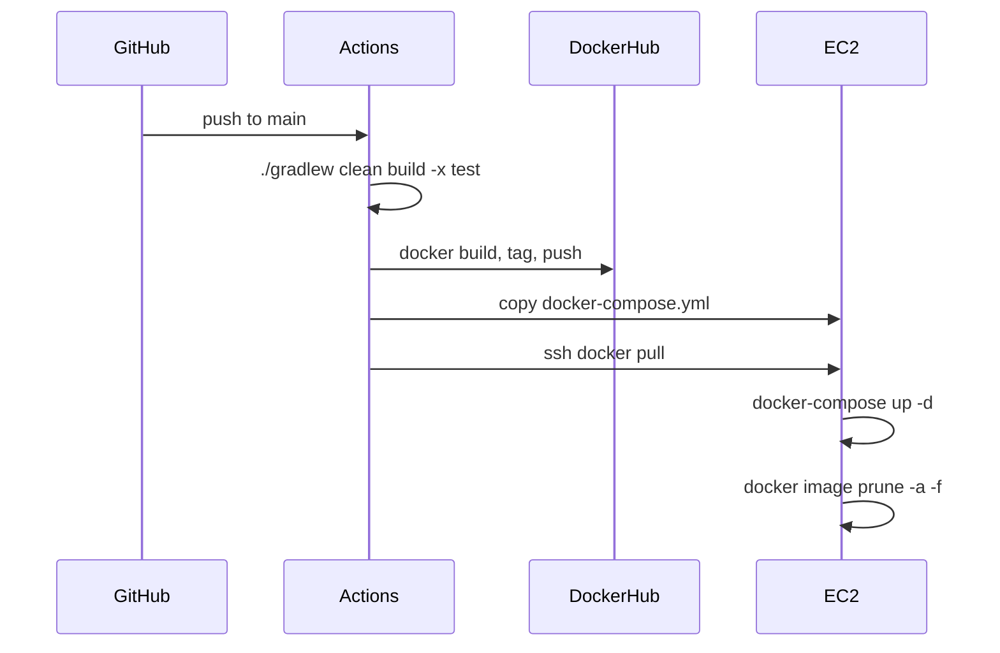

# Deployment

본 프로젝트의 배포 구조는 repository에 포함된 GitHub Actions workflow, Dockerfile, docker-compose 파일 기준으로 확인했습니다. README에 언급된 항목이라도 repository 파일로 확인되지 않은 내용은 사실처럼 확장하지 않았습니다.

## 확인된 배포 구성

| 파일 | 확인한 내용 |
| :--- | :--- |
| `.github/workflows/deploy.yml` | `main` push 시 빌드, Docker image push, EC2 배포 |
| `Dockerfile` | Java 21 JRE alpine 이미지, jar 실행, 8080 expose |
| `docker-compose.yml` | app container와 mongo container 실행, app은 host 8082에서 container 8080으로 매핑 |
| `src/main/resources/application.yaml` | `.env` optional import, `MONGO_URI`, `SERVER_URL` 사용 |

## GitHub Actions 배포 흐름

## Dockerfile

| 항목 | 값 |
| :--- | :--- |
| Base image | `eclipse-temurin:21-jre-alpine` |
| Workdir | `/app` |
| Artifact | `build/libs/*.jar` -> `app.jar` |
| User | `nobody` |
| Port | `8080` |
| Entrypoint | `java -jar app.jar` |

## docker-compose

| Service | 내용 |
| :--- | :--- |
| `app` | `stdiodh/java-open-mission-8:latest` 이미지 사용 |
| `app` port | host `8082` -> container `8080` |
| `app` env | `/home/ec2-user/app/java-open-mission-8/.env` |
| `mongo` | `mongo:latest` 이미지 사용 |
| volume | `mongodb-data:/data/db` |
| network | `open-mission-8-network` bridge |

## 환경 변수

| 변수 | 사용 위치 | 설명 |
| :--- | :--- | :--- |
| `MONGO_URI` | `spring.data.mongodb.uri` | MongoDB 연결 문자열 |
| `SERVER_URL` | Swagger server URL, CORS allowed origin | 기본값은 `http://localhost:8080` |

민감정보와 실제 secret 값은 workflow에서 `${{ secrets.* }}`로만 참조되며, 문서에는 노출하지 않습니다.

## 확인되지 않은 항목

| 항목 | 상태 |
| :--- | :--- |
| Nginx 설정 파일 | repository에서 확인되지 않음 |
| Certbot 설정 파일 | repository에서 확인되지 않음 |
| 실제 운영 서버 주소 | secret 또는 외부 환경으로 관리되어 문서화하지 않음 |
| 배포 성공 로그 | repository 파일만으로 확인 불가 |

## 주의할 점

- deploy workflow는 `./gradlew clean build -x test`로 테스트를 제외하고 빌드합니다.
- 테스트 workflow는 별도로 존재하지만, 배포 workflow 내부에서 테스트 성공을 직접 보장하지는 않습니다.
- EC2에 `.env`가 없거나 `MONGO_URI`가 유효하지 않으면 애플리케이션 기동 또는 MongoDB 연결에서 실패할 수 있습니다.
